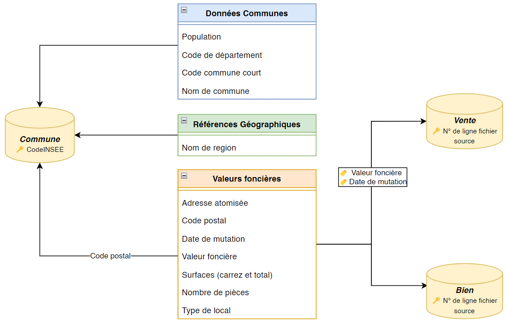
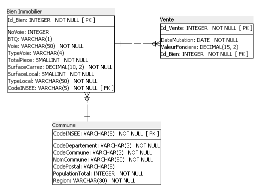
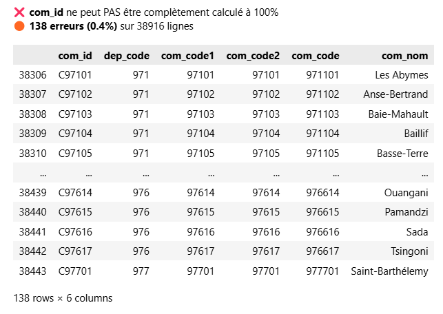

# 🏗️ Real Estate Transactions — SQL Database POC


> **End-to-end data engineering proof of concept:** ingesting, cleaning, and querying 34K+ French real estate transactions using pandas, SQLAlchemy, and SQL Server.

---

## Overview

Raw government open data on French real estate transactions (H1 2020) was spread across 3 disconnected source files with no reliable common key. This project builds a **normalized relational database (3NF)** from scratch: data profiling, key engineering, RGPD-compliant transformation, SQL Server population via SQLAlchemy, and 12 business SQL queries — all delivered as a Proof of Concept to validate feasibility before a full-scale deployment.

---

## 🏷️ Real Estate Transactions — SQL Database & Analytics Engine (POC)

**Turning 3 disconnected government datasets into a queryable, production-ready SQL database.**

---

## 🎯 The Challenge

**Simulated business case — Laplace Immo** (a fictional national real estate agency network).

The agency wants to gain a **data-driven competitive edge** by tracking all real estate transactions across France. The analytics team needs answers to 12 key business questions:

- Which regions have the highest apartment sales volume?
- What is the average price per m² by department?
- How does the market evolve between Q1 and Q2?
- Where are the most dynamic communes per 1,000 inhabitants?

The problem: **the data existed, but it was unusable.** Three separate government files, no shared primary key, data quality issues, and RGPD constraints to address before a single query could be written.

---

## 💡 The Solution & Architecture



The architecture follows a classic **Extract → Transform → Load** pattern:

**1. Extract**
- **Valeurs foncières** — 34,169 rows of property transaction records (price, surface, address, type)
- **Données communes** — 34,991 French communes with department/population data
- **Référentiels Géographiques** — regional geographic reference file

**2. Transform (pandas)**
- Data profiling and type validation on all columns
- RGPD compliance: **buyer names excluded**, address data atomized (street number, street name, postal code)
- **Key engineering:** computed `code_insee` (VARCHAR 5) = `code_departement (2) + code_commune (3)` to create a reliable join key across the 3 sources
- Surface normalization: conditional `calc_surface` and `calc_prix_m2` columns based on property type
- File slicing and column reordering for SQL Server import compatibility

**3. Load (SQLAlchemy + SQL Server)**
- Schema generated via **SQL Power Architect** (MPD → DDL script)
- Tables created with integrity constraints (PK, FK, CHECK on `type_local`, CHECK on `valeur_fonciere > 0`)
- Bulk population via SQLAlchemy + `SET IDENTITY INSERT`
- Post-load integrity verification (orphan checks, row count validation)



**4. Analyze (SQL Server)**
- Central analytical view `V_Transactions_Completes` joins all 3 tables
- 12 business queries covering volume, price, geography, and time-series analysis

---

## 🛠️ Tech Stack

| Layer | Tool | Role |
|---|---|---|
| **Data Profiling & Cleaning** | `pandas` | EDA, type validation, key engineering, file preparation |
| **DB Connection & Population** | `SQLAlchemy` | Engine, bulk insert, `SET IDENTITY` commands |
| **Database** | `Microsoft SQL Server` | Table storage, query execution, analytical views |
| **Data Modeling** | `SQL Power Architect` | MPD design, DDL script generation |
| **Dependency Management** | `Poetry` | Python environment reproducibility |

**Key Python libraries:** `pandas`, `sqlalchemy`, `pyodbc`, `openpyxl`

---

## 🚀 How to Run

### Prerequisites

- [Docker Desktop](https://www.docker.com/products/docker-desktop)
- SSMS or Azure Data Studio (optional — to run business queries)

That's it — Python, Jupyter, SQL Server, and all dependencies run inside Docker.

### 1. Clone the repository

```bash
git clone https://github.com/abguven/french-real-estate-sql-poc.git
cd french-real-estate-sql-poc
```

### 2. Configure environment variables

```bash
cp .env.example .env
```

Edit `.env` and set your SA password. Leave `DB_HOST=sql-server` as-is for Docker.

### 3. Add your data files

Place the source files in `data/raw/`:

- `valeurs_foncieres.xlsx`
- `donnees_communes.xlsx`
- `fr-esr-referentiel-geographique.xlsx`

> Data files are excluded from this repo (`.gitignore`). Download them from [data.gouv.fr](https://www.data.gouv.fr/fr/datasets/demandes-de-valeurs-foncieres/) — H1 2020 dataset.

### 4. Start everything

```bash
docker compose up --build
```

This spins up two containers: **SQL Server** and **Jupyter**. SQL Server starts first and automatically creates the `LaplaceImmo` database and schema. Once ready, open the Jupyter URL shown in the terminal (e.g. `http://127.0.0.1:8888/...`).

### 5. Run the ETL pipeline

Open `real_estate_analysis_etl.ipynb` in Jupyter and run all cells.

The notebook handles the full pipeline: data profiling → cleaning → key engineering → SQL Server population.

### 6. Run the business queries

Open `SQL/Requetes demandées.sql` in SSMS or Azure Data Studio and execute against the `LaplaceImmo` database.

---

## 🧠 Technical Challenges Overcome

### 1. No common join key across 3 source files

**Problem:** The 3 government files used incompatible geographic identifiers. The `Valeurs foncières` file had `code_commune` (3 chars) + `code_departement` (3 chars). The `Référentiels Géographiques` file used `com_id` (6 chars, `C` prefix + CodeINSEE format) — making a direct join impossible. Investigation revealed 138 rows (0.4%) where the naive `com_id` derivation failed due to overseas territory codes (DOM-TOM, 971–977) producing a 6-char result instead of 5.



**Solution:** Rather than relying on the geographic reference file's `com_id`, the `code_insee` key was computed **directly from the `Valeurs foncières` file**: `code_departement[:2].zfill(2) + code_commune.zfill(3)`. The edge case (195 rows where `code_departement` had 3 digits) was handled by truncating to the first 2 significant characters before concatenation. This yielded a **100% coverage** on all 34,169 rows.

### 2. Data quality issues in source files

**Problem:** Multiple columns had severe quality issues:
- `Voie` column: mixed types (strings, dates, integers coexisting in the same column)
- `B/T/Q` column: 93.6% missing values
- `valeur_fonciere`: 18 NULL rows (donations, successions — non-monetary transactions)

**Solution:** Pandas-based profiling before any transformation. `valeur_fonciere` was kept **nullable** intentionally — forcing NULL to 0 would have skewed `AVG()` and `SUM()` aggregations. A `CHECK (valeur_fonciere > 0 OR valeur_fonciere IS NULL)` constraint was added at the DB level to preserve analytical integrity.

### 3. Surface calculation complexity by property type

**Problem:** Houses and apartments use different surface metrics (`surface_locale` for houses, `surface_carrez` for apartments), making a unified `prix_m2` calculation non-trivial.

**Solution:** Implemented a `CASE WHEN type_local = 'Maison' THEN surface_local WHEN type_local = 'Appartement' THEN surface_carrez END AS calc_surface` expression inside the `V_Transactions_Completes` SQL view — centralizing the business logic in one place, reused by all 12 queries.

### 4. RGPD compliance by design

**Problem:** The raw `Valeurs foncières` file contains buyer names — a RGPD-sensitive personal data field.

**Solution:** Buyer name columns were **excluded at the pandas transformation stage**, before any data ever reached the database. Address data (street, postal code) was retained as it is necessary for geographic analysis and does not constitute personal data under the project's scope.

---

## 📊 Key Results (H1 2020)

- **31,378** apartment transactions recorded
- **Île-de-France** = 45% of all apartment sales
- **2–3 room apartments** = ~60% of all transactions
- **Paris (dept. 75)** = highest avg. price/m² at **12,056€**
- **Avg. house price/m² in Île-de-France:** 3,997€
- **Market concentration:** only 48 communes with 50+ transactions in Q1
- **Seasonal effect:** +3.66% transaction volume from Q1 to Q2 (spring effect)
